# HDLBits - SystemVerilog Solutions

This repository contains my personal solutions to the [HDLBits](https://hdlbits.01xz.net/wiki/Main_Page) hardware design practice platform.

As part of my focus on **FPGA architectures and low-level hardware development**, I use this space as a "digital gym" to sharpen my RTL design skills, deepen my understanding of combinational/sequential logic, and build muscle memory in **SystemVerilog**.

---

## Repository Structure & Circuit Schematics

Below is an index of my completed modules, mapped directly to their conceptual circuit diagrams.

### 🏁 1. Getting Started

| Exercise     | Source Code                                    | Circuit Schematic                                                         |
| :----------- | :--------------------------------------------- | :------------------------------------------------------------------------ |
| **Step One** | [`step_one.sv`](./Getting_Started/step_one.sv) | 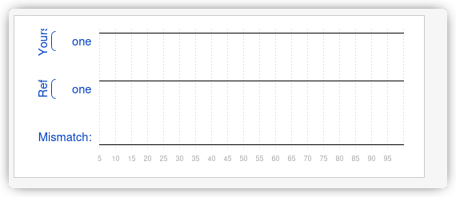 |
| **Zero**     | [`zero.sv`](./Getting_Started/zero.sv)         | 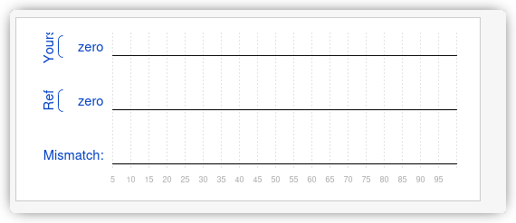         |

---

### 2. Verilog Language

#### Basics

Fundamental logic gates, continuous assignments, and wire declarations.

| Exercise      | Source Code                                              | Circuit Schematic                                                   |
| :------------ | :------------------------------------------------------- | :------------------------------------------------------------------ |
| **Wire**      | [`wire.sv`](./Verilog_Language/Basics/wire.sv)           | 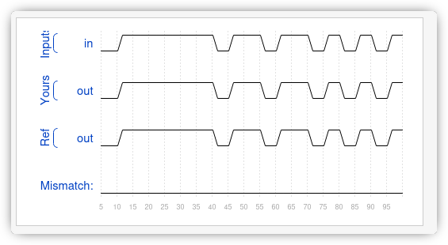      |
| **Wire 4**    | [`wire4.sv`](./Verilog_Language/Basics/wire4.sv)         | 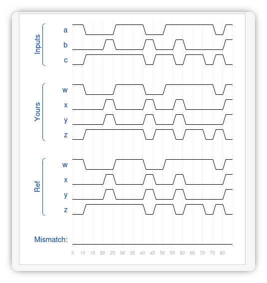     |
| **Wire Decl** | [`wire_decl.sv`](./Verilog_Language/Basics/wire_decl.sv) | 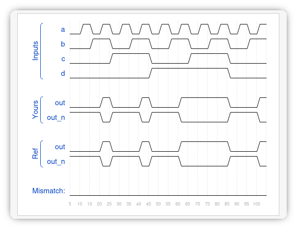 |
| **NOT Gate**  | [`notgate.sv`](./Verilog_Language/Basics/notgate.sv)     | 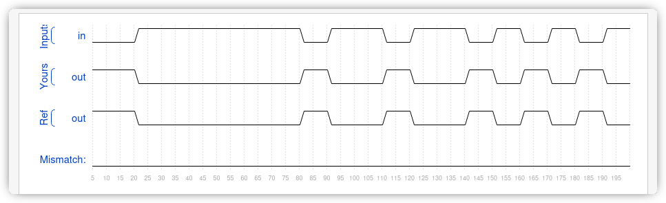   |
| **AND Gate**  | [`andgate.sv`](./Verilog_Language/Basics/andgate.sv)     | 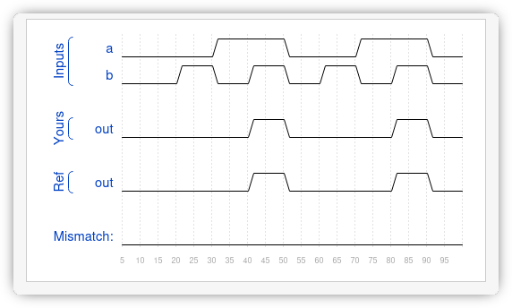   |
| **NOR Gate**  | [`norgate.sv`](./Verilog_Language/Basics/norgate.sv)     | 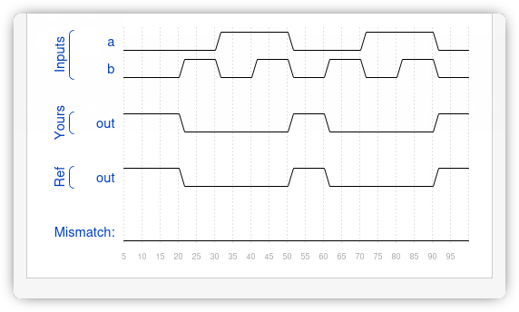   |
| **XNOR Gate** | [`xnorgate.sv`](./Verilog_Language/Basics/xnorgate.sv)   | 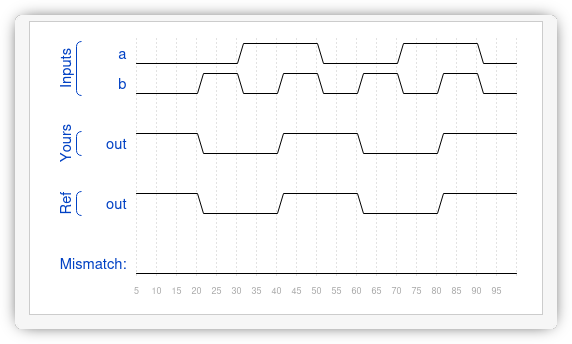  |
| **7458 Chip** | [`7458_chip.sv`](./Verilog_Language/Basics/7458_chip.sv) | 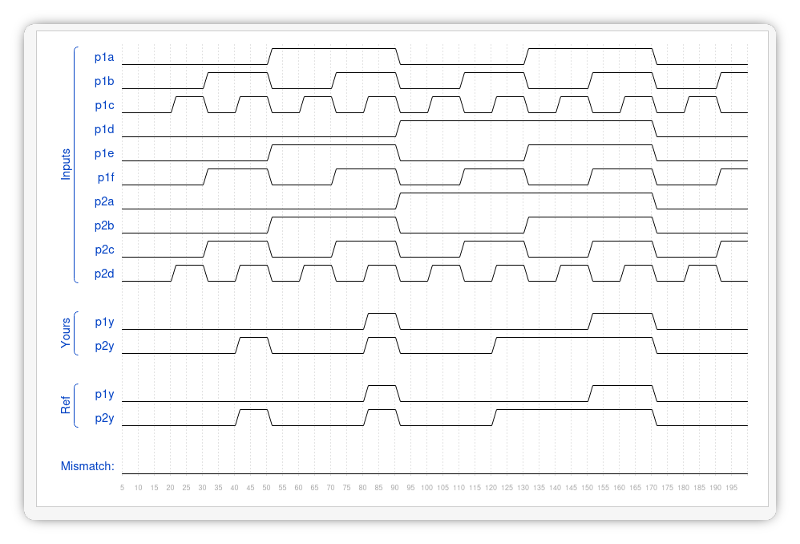 |

####  Modules & Hierarchy

Connecting modules, mapping ports by position/name, and hierarchical design.

| Exercise           | Source Code                                                                 | Circuit Schematic                                                                  |
| :----------------- | :-------------------------------------------------------------------------- | :--------------------------------------------------------------------------------- |
| **Module**         | [`module.sv`](./Verilog_Language/Modules_Hierarchy/module.sv)               | 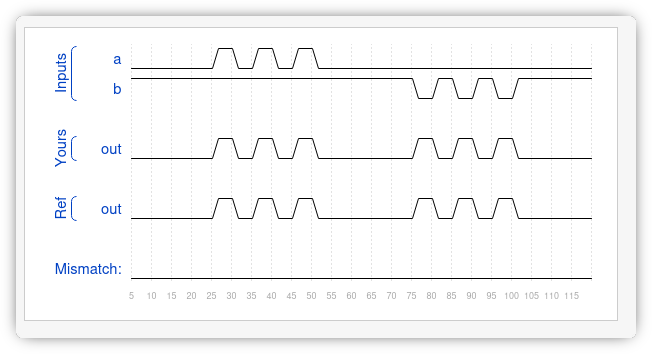        |
| **Module Pos**     | [`module_pos.sv`](./Verilog_Language/Modules_Hierarchy/module_pos.sv)       |     |
| **Module Name**    | [`module_name.sv`](./Verilog_Language/Modules_Hierarchy/module_name.sv)     | 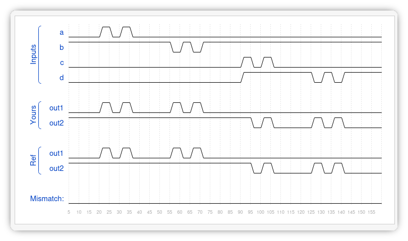   |
| **Module Shift**   | [`module_shift.sv`](./Verilog_Language/Modules_Hierarchy/module_shift.sv)   | 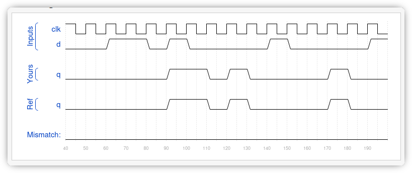  |
| **Module Shift 8** | [`module_shift8.sv`](./Verilog_Language/Modules_Hierarchy/module_shift8.sv) | 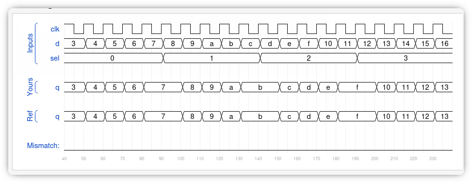 |
| **Module Add**     | [`add.sv`](./Verilog_Language/Modules_Hierarchy/add.sv)                     | 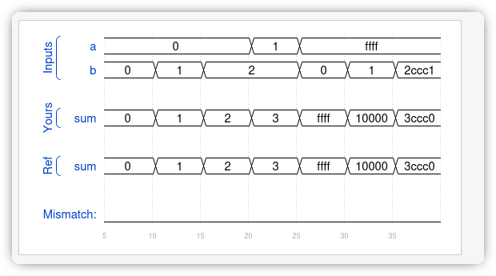           |
| **Module FAdd**    | [`module_fadd.sv`](./Verilog_Language/Modules_Hierarchy/module_fadd.sv)     | 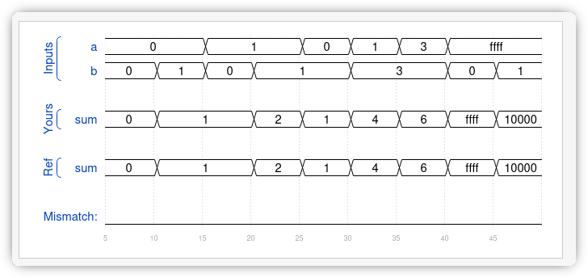   |

#### Vectors

Vector manipulation, bitwise vs. logical operators, slicing, and replication.

| Exercise            | Source Code                                                   | Circuit Schematic                                                      |
| :------------------ | :------------------------------------------------------------ | :--------------------------------------------------------------------- |
| **Vector 0**        | [`vector0.sv`](./Verilog_Language/Vectors/vector0.sv)         | 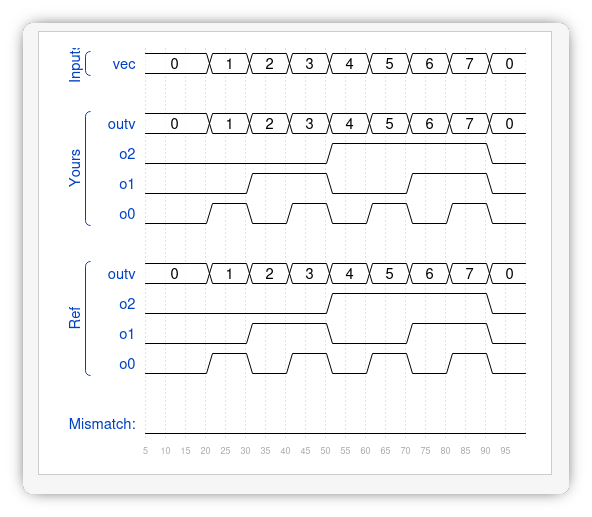     |
| **Vector 1**        | [`vector1.sv`](./Verilog_Language/Vectors/vector1.sv)         | 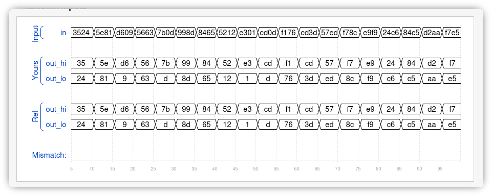     |
| **Vector 2**        | [`vector2.sv`](./Verilog_Language/Vectors/vector2.sv)         | 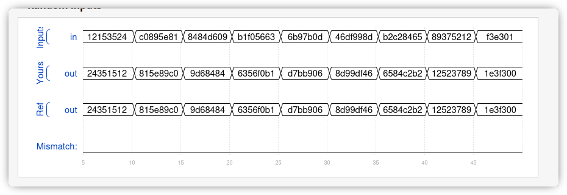     |
| **Vector 3**        | [`vector3.sv`](./Verilog_Language/Vectors/vector3.sv)         | 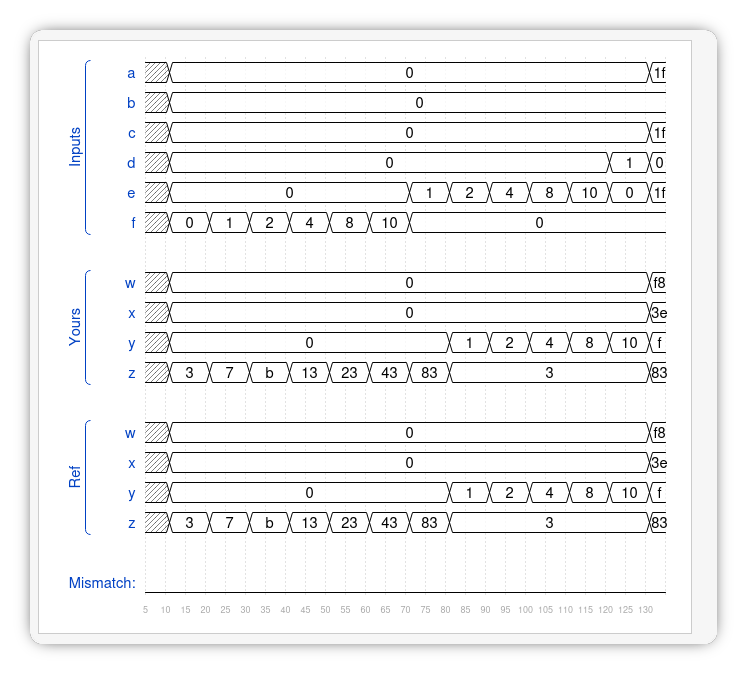     |
| **Vector Gates**    | [`vectorgates.sv`](./Verilog_Language/Vectors/vectorgates.sv) | 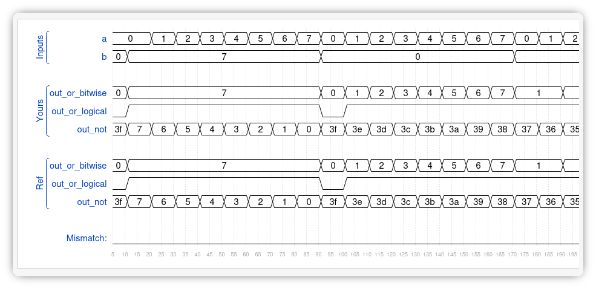 |
| **Gates 4**         | [`gates4.sv`](./Verilog_Language/Vectors/gates4.sv)           | 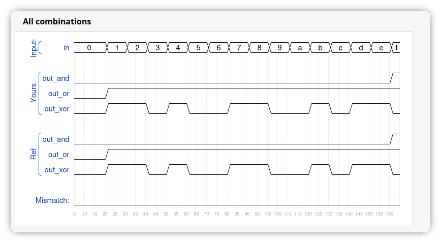      |
| **Vector Reversal** | [`vectorr.sv`](./Verilog_Language/Vectors/vectorr.sv)         | 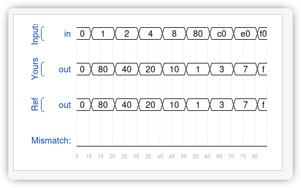     |

_Note: Additional vector exercises without graphical schematics (`vector4.sv`, `vector5.sv`) are also included in the source folder._

---
